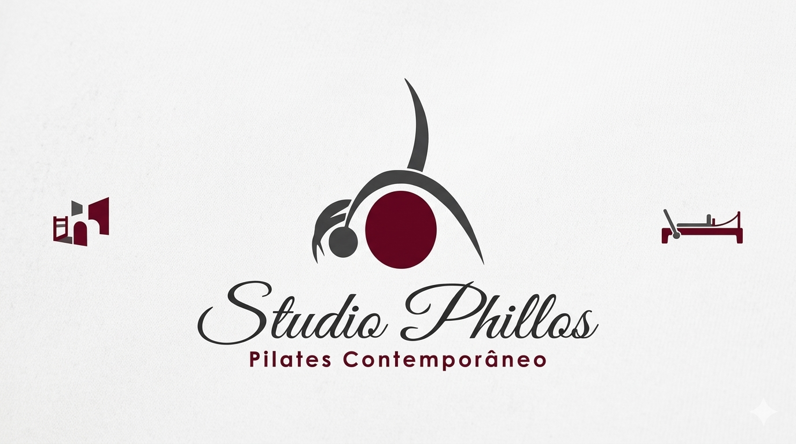
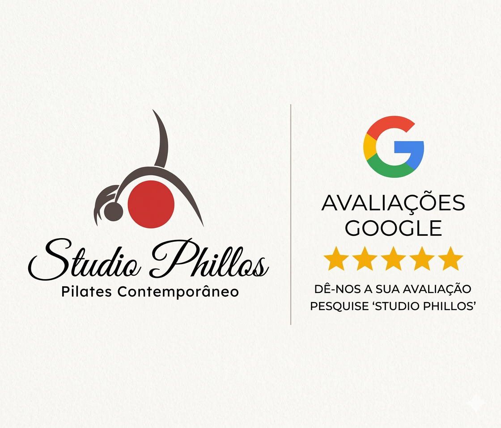

# StudioPhillos
Studio Phillos Pilates Contemporâneo 
# 🧘‍♀️ Studio Phiillos | Pilates Contemporâneo & Fisioterapia

> Site institucional responsivo desenvolvido para o **Studio Phiillos**, localizado em Teresópolis - RJ. O projeto apresenta o espaço, os serviços oferecidos e conta com uma galeria de resultados reais com vídeos otimizados de alunos.

🎨 **[Acesse o Site Oficial Aqui](http://studiophillospilates.com.br/)**

---

## 📸 Demonstração Visual

| Desktop Version | Mobile Version (Menu Lateral) |
|---|---|
|  |  |

---

## ✨ Funcionalidades Principais

* **Design Premium e Responsivo:** Interface limpa e sofisticada adaptada para qualquer tamanho de tela (Desktop, Tablet e Mobile).
* **Menu Lateral Mobile:** Menu estilo *hamburger* que desliza elegantemente da **direita para a esquerda**, otimizando o espaço em smartphones.
* **Navegação Suave (*Smooth Scroll*):** Rolagem fluida entre as seções da página com compensação de altura da barra de navegação.
* **Páginas Dedicadas de Vídeos:** Divisão estratégica de depoimentos em páginas isoladas (`/videos/pilates.html` e `/videos/fisioterapia.html`) para melhor experiência do usuário e SEO.
* **Prova Social Integrada:** Destaque para a nota máxima (5.0/5.0) do Google com selo personalizado e chamada para ação (*CTA*).
* **Botão de Conversão Direta:** Integração com a API do WhatsApp pré-configurada com mensagem personalizada de agendamento de aula experimental.

---

## 🛠️ Tecnologias Utilizadas

O projeto foi construído utilizando tecnologias web fundamentais (Vanilla), focando em performance e carregamento ultra-rápido:

* **HTML5:** Estrutura semântica e inclusão nativa de players de vídeo otimizados (`preload="metadata"`).
* **CSS3:** Layouts modernos, variáveis nativas (`:root`), flexbox, grid e animações de transição personalizadas.
* **JavaScript (ES6):** Manipulação de DOM para o menu interativo e gerenciamento limpo de eventos com otimização BFCache (`pagehide`).
* **Font Awesome (v6.4.2):** Ícones vetoriais de alta resolução para redes sociais e interface.
* **Google Fonts:** Combinação tipográfica elegante com as fontes *Montserrat* e *Playfair Display*.

---

## 📂 Estrutura do Projeto

```text
├── index.html          # Página principal (Home)
├── style.css           # Arquivo geral de estilização CSS
├── script.js          # Scripts de interatividade e performance
├── img/                # Banco de imagens, logos e badges
│   ├── capa.png
│   ├── roberto.png
│   └── avaliacao.png
├── arqvideos/          # Arquivos de vídeo compactados (.mp4)
│   ├── video1.mp4
│   └── ...
└── videos/             # Páginas internas dos serviços
    ├── pilates.html
    └── fisioterapia.html
